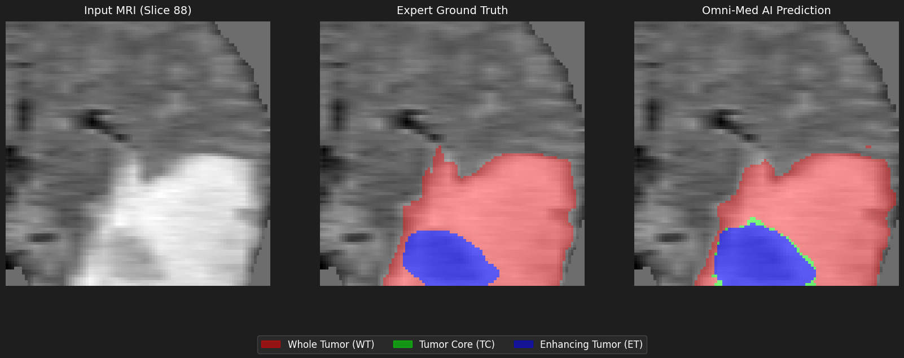

# TumorVision

> Automated 3D brain tumor segmentation from multi-modal MRI using Swin-UNETR, with interactive visualization.

## Overview
Trained on the BraTS 2021 dataset to segment three tumor sub-regions — Tumor Core (TC), Whole Tumor (WT), and Enhancing Tumor (ET) — from 4-channel MRI input (T1, T1ce, T2, FLAIR).

## Features
- 🧠 Swin-UNETR transformer architecture via MONAI
- 🎯 Multi-class segmentation: TC, WT, ET
- 📊 Sliding window inference on full 240×240×155 volumes
- 🌐 Interactive 3D neon tumor mesh visualization
- 🖥️ Gradio web UI for one-click inference

## Results


## Tech Stack
Python · PyTorch · MONAI · PyTorch Lightning · Gradio · Plotly

## Setup
```bash
git clone https://github.com/yourusername/tumor-vision
cd tumor-vision
pip install -r requirements.txt
```

## Usage
```bash
# Train
python train_brats.py

# Run web UI
python app.py
```

## Dataset
[BraTS 2021](https://www.synapse.org/#!Synapse:syn25829067) — 
import kagglehub
path = kagglehub.dataset_download(
    "dschettler8845/brats-2021-task1"
)
print("Path to dataset files:", path)
